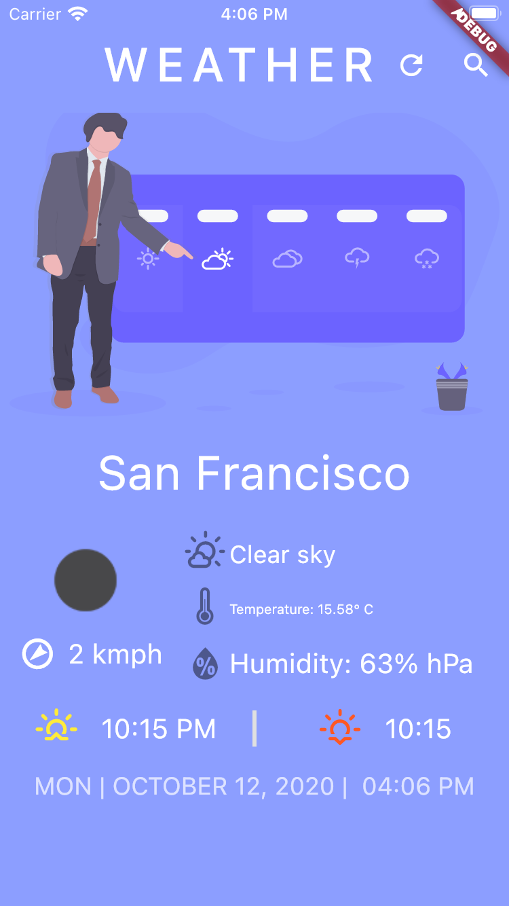

# weather_app_with_getx
weather_app_with_getx

### Reference 

Weather app functionality take from https://github.com/pratik037/Weather

Modify it into GetX style.

### Project Screenshot

### Using quick type to generate schema

https://app.quicktype.io/

Using Dart language
- Put encoder & decoder in Class
- Make all properties optional
